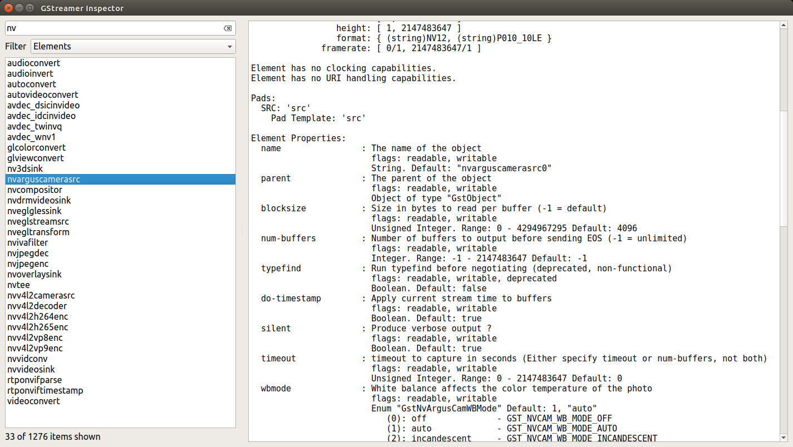

# gst-explorer
GStreamer GUI Interface Tool

GUI interface for inspecting GStreamer Plugins, Elements and Type Finders. 

Expects Python3 Qt, PyQt5 and GStreamer to be installed. These are installed by default on the standard NVIDIA Jetson JetPack 4.6+ images.

To run the Inspector:
```
$ python3 ./gst-inspector.py
```



## Notes

### November, 2021
* Initial Release
* Tested on NVIDIA Jetson Nano and Jetson Xavier NX
* JetPack 4.6, L4T 32.6.1
